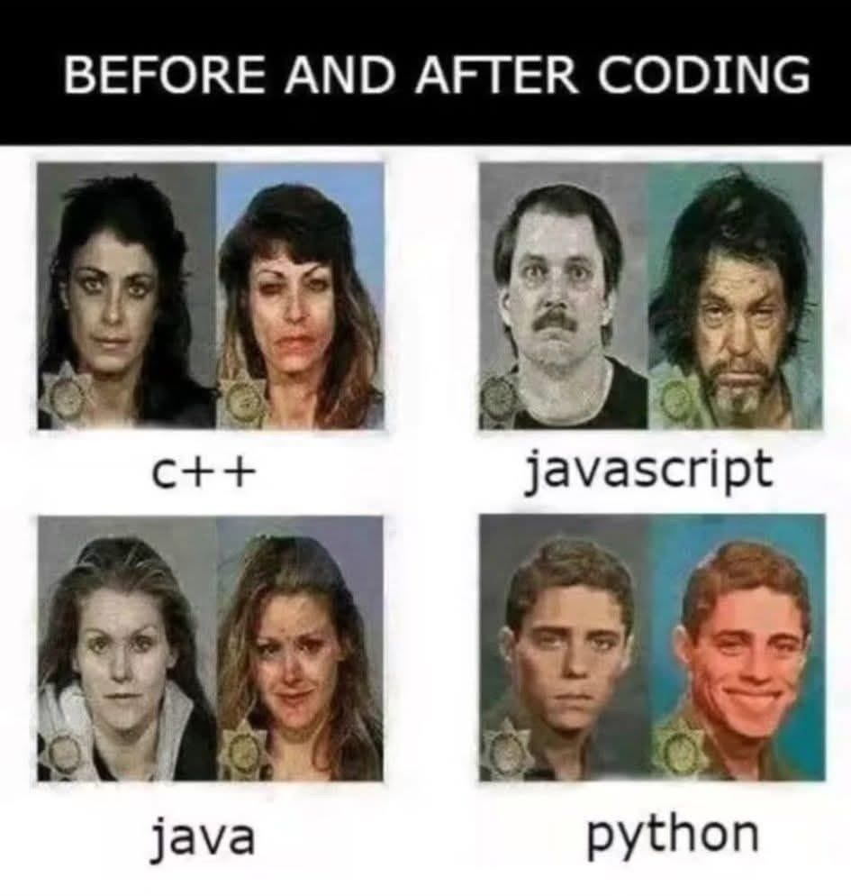

<h1>Introducing Myself 🙋🏻‍♂️</h1>

Hey now, I'm Mohammad, an aspiring software developer with an interest in cybersecurity and full stack web application development.

**📚 Projects**
  
Welcome to my portfolio, where I showcase my <a href="https://github.com/mohammadhosman?tab=repositories">projects</a>.

**🛠️ Tools**
<ul>
<li>Front-End Development: HTML, CSS, React, JavaScript</li>
<li>Back-End Development: Python, Django, Flask, Express, Node.js</li>
<li>Database: MongoDB, MySQL, PostgreSQL</li>
</ul>

**🤝Connect with Me** 
<ul>
  <li> Contact me on <a href="https://www.linkedin.com/in/mohammadhosman/"> LinkedIn </a> </li>
  <li>
Or <a href="mailto:mohosman93@hotmail.com">send me an email 📩</a>
</li>
</ul>

Thanks for dropping by my portfolio. I hope to hear from you! Here is a parting gift from me:
  

<h3>Have a good day!👋🏻</h3>

<!--

- 🔭 I’m currently working on ...
- 🌱 I’m currently learning ...
- 👯 I’m looking to collaborate on ...
- 🤔 I’m looking for help with ...
- 💬 Ask me about ...
- 📫 How to reach me: ...
- 😄 Pronouns: ...
- ⚡ Fun fact: ...
-->
